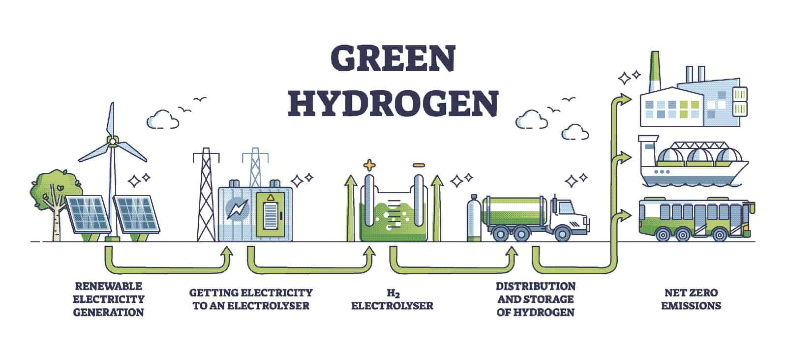

<h1 align="center">:wave: Welcome to GEDPL </h1>

  
   

Welcome to the GitHub homepage of the  **Green Energy and Digital Processes Lab** led by **Prof.Sai Gu** at the **University of Warwick**. 

The **Green Energy & Digital Processes Lab**(GEDPL) focuses on the study of hydrogen economy, pays closed attention to the **functionalized materials** including **electrodes**, **membranes**,**catalysts**, and **porous transport layer**. By applying **machine learning** and **virtural reality** tools,we further enhance the impact of our research and make it significant to change the daily life. 

<!--   profile-green-animate -->

PMEAL is run by Prof. [Prof. Sai Gu](https://scholar.google.com/citations?user=EufoqsMAAAAJ&hl=en&oi=ao). and is located at the University of Warwick, in the School of Engineering. For more information on the type of projects being pursued by the GEDPL team, take a look at the Publications page, or check out Google Scholar profile of [Prof. Sai Gu](https://scholar.google.com/citations?user=EufoqsMAAAAJ&hl=en&oi=ao).

For a list of our group's publications , please visit the Google Scholar profile of [Prof. Sai Gu](https://scholar.google.com/citations?user=EufoqsMAAAAJ&hl=en&oi=ao).

